# System 模块文档

## 概述

System 模块是 Galaxy Ops 框架的核心系统管理层，负责系统初始化、配置管理、资源分配和系统状态维护。它提供了系统级的抽象和服务，是整个应用的基础架构层，支持模块化组合、统一管理和多环境部署。

## 系统架构

### 系统层设计

```
┌─────────────────────────────────────────────┐
│              Application Layer                │  
│  (应用层: 用户接口、业务逻辑、服务暴露)           │
├─────────────────────────────────────────────┤
│              System Layer                    │
│  (系统管理层: 模块组合、生命周期管理、配置协调)    │
├─────────────────────────────────────────────┤
│          Infrastructure Layer                │
│  (基础设施层: 存储、网络、计算、监控)           │
└─────────────────────────────────────────────┘
```

### 核心组件架构

```mermaid
graph TB
    subgraph "System Core Architecture"
        A[SystemManager] --> B[SystemInitializer]
        A --> C[ConfigManager]
        A --> D[ResourceManager]
        A --> E[StateMonitor]
        A --> F[ProjectManager]
        A --> G[AccessorManager]
        
        B --> H[InitConfig]
        B --> I[InitStep]
        B --> J[InitResult]
        
        C --> K[SystemConfig]
        C --> L[ConfigLoader]
        C --> M[ConfigValidator]
        
        D --> N[ResourceAllocator]
        D --> O[ResourcePool]
        D --> P[ResourceMonitor]
        
        E --> Q[SystemState]
        E --> R[HealthChecker]
        E --> S[MetricsCollector]
        
        F --> T[ProjectSpec]
        F --> U[ProjectRefs]
        F --> V[ProjectPath]
        
        G --> W[UniversalAccessor]
        G --> X[AccessCtrl]
    end
    
    subgraph "System States"
        Q --> Q1[Initializing]
        Q --> Q2[Ready]
        Q --> Q3[Running]
        Q --> Q4[Maintenance]
        Q --> Q5[Shutdown]
    end
    
    subgraph "Resource Types"
        N --> N1[CPU]
        N --> N2[Memory]
        N --> N3[Disk]
        N --> N4[Network]
    end
    
    subgraph "Configuration Sources"
        L --> L1[YAML Files]
        L --> L2[Environment Variables]
        L --> L3[System Variables]
        L --> L4[Accessor Config]
    end
```



## 核心职责

### 1. 系统初始化 (System Initialization)
- 系统启动和初始化流程管理
- 环境检查和依赖验证
- 配置文件加载和验证
- 模块组合和依赖解析
- 服务编排和启动顺序

### 2. 配置管理 (Configuration Management)
- 系统配置的统一管理
- 多环境配置支持
- 配置验证和类型检查
- 热重载和动态配置
- 配置版本控制和回滚

### 3. 资源管理 (Resource Management)
- 系统资源的统一分配
- 资源池管理和优化
- 资源监控和限制
- 依赖下载和缓存
- 存储和网络管理

### 4. 状态监控 (State Monitoring)
- 系统状态实时监控
- 健康检查和故障检测
- 性能指标收集
- 告警和日志记录
- 状态报告和分析

### 5. 生命周期管理 (Lifecycle Management)
- 系统创建、更新、删除
- 版本管理和发布
- 回滚和恢复机制
- 升级和迁移支持
- 备份和灾难恢复

## 核心组件详解

### 1. 系统初始化 (System Initialization)

**文件**: `init.rs`

**主要组件**:
- **SystemInitializer**: 系统初始化器，负责协调整个初始化流程
- **InitConfig**: 初始化配置，包含初始化参数和选项
- **InitStep**: 初始化步骤定义，支持异步执行
- **InitResult**: 初始化结果，包含状态和错误信息

**功能特性**:
- 渐进式系统初始化
- 异步步骤执行
- 错误处理和回滚
- 进度反馈和日志记录
- 环境兼容性检查

**初始化流程**:
```rust
use galaxy_ops::system::{SystemInitializer, SystemConfig};

#[tokio::main]
async fn main() -> Result<(), Box<dyn std::error::Error>> {
    // 创建系统配置
    let config = SystemConfig::from_file("config/system.yml")?;
    
    // 创建初始化器
    let initializer = SystemInitializer::new(config);
    
    // 执行初始化流程
    let result = initializer
        .check_environment()
        .load_config()
        .init_accessor()
        .init_directories()
        .init_services()
        .finalize()
        .await?;
    
    match result {
        InitResult::Success => println!("系统初始化完成"),
        InitResult::Partial(steps) => println!("部分初始化完成: {:?}", steps),
        InitResult::Failed(error) => return Err(error),
    }
    
    Ok(())
}
```

### 2. 系统路径管理 (System Path)

**文件**: `path.rs`

**主要组件**:
- **SystemPath**: 系统路径管理器，统一管理所有路径
- **PathResolver**: 路径解析器，支持多种路径格式
- **PathConfig**: 路径配置，支持自定义路径模板

**路径类型**:
- **项目路径**: 项目根目录和子目录
- **配置路径**: 配置文件存储路径
- **数据路径**: 应用数据存储路径
- **日志路径**: 日志文件存储路径
- **缓存路径**: 缓存文件存储路径
- **临时路径**: 临时文件存储路径

**使用示例**:
```rust
use galaxy_ops::system::SystemPath;

let sys_path = SystemPath::new();

// 获取项目根目录
let project_root = sys_path.get_project_root();

// 获取配置路径
let config_path = sys_path.get_config_path();
let app_config = config_path.join("app.yml");

// 获取数据路径
let data_path = sys_path.get_data_path();
let user_data = data_path.join("users.json");

// 获取日志路径
let log_path = sys_path.get_log_path();
let system_log = log_path.join("system.log");

// 获取缓存路径
let cache_path = sys_path.get_cache_path();
let temp_cache = cache_path.join("temp");

// 解析相对路径
let absolute_path = sys_path.resolve("config/settings.yml");
```

### 3. 系统项目管理 (System Project)

**文件**: `proj.rs`

**主要组件**:
- **SystemProject**: 系统项目管理器，负责项目级别的管理
- **ProjectSpec**: 项目规范定义，包含项目配置
- **ProjectRefs**: 项目引用管理，支持模块和资源引用
- **ProjectPath**: 项目路径管理，统一项目路径规范

**功能特性**:
- 项目结构验证和完整性检查
- 配置文件管理
- 模块依赖关系管理
- 版本兼容性检查
- 项目生命周期管理

**项目结构**:
```
system-project/
├── _gal/                              # 项目配置目录
│   ├── adm.gxl                       # 系统管理配置
│   ├── work.gxl                      # 工作流环境配置
│   └── project.toml                  # 项目元数据配置
├── sys/                              # 系统定义目录
│   ├── sys_model.yml                 # 系统模型定义
│   ├── mod_list.yml                  # 模块列表定义
│   ├── vars.yml                      # 系统变量定义
│   ├── mods/                         # 模块本地化副本
│   └── workflows/                    # 系统工作流定义
├── sys-prj.yml                       # 系统项目配置
├── version.txt                       # 系统版本信息
└── .gitignore                        # Git 忽略文件
```

### 4. 系统引用管理 (System References)

**文件**: `refs.rs`

**主要组件**:
- **SystemRefs**: 系统引用管理器，统一管理所有引用
- **RefResolver**: 引用解析器，支持多种引用格式
- **RefValidator**: 引用验证器，确保引用有效性

**引用类型**:
- **模块引用**: 模块间的依赖引用
- **配置引用**: 配置文件间的引用
- **资源引用**: 外部资源引用
- **服务引用**: 服务间的调用引用

**引用管理**:
```rust
use galaxy_ops::system::SystemRefs;

let refs = SystemRefs::new();

// 注册模块引用
refs.register_module("auth", "../modules/auth");
refs.register_module("database", "../modules/database");

// 注册配置引用
refs.register_config("app_config", "config/app.yml");
refs.register_config("database_config", "config/database.yml");

// 注册资源引用
refs.register_resource("static_assets", "public/assets");
refs.register_resource("templates", "templates");

// 解析引用
let auth_module = refs.resolve_module("auth");
let db_config = refs.resolve_config("database_config");
let assets = refs.resolve_resource("static_assets");

// 验证所有引用
let validation_result = refs.validate_all();
match validation_result {
    Ok(_) => println!("所有引用验证通过"),
    Err(errors) => println!("引用验证失败: {:?}", errors),
}
```

### 5. 系统规范管理 (System Specification)

**文件**: `spec.rs`

**主要组件**:
- **SystemSpec**: 系统规范定义，包含系统配置规范
- **SpecValidator**: 规范验证器，验证配置规范性
- **SpecGenerator**: 规范生成器，自动生成规范文档

**规范类型**:
- **系统规范**: 整体系统架构规范
- **模块规范**: 各个模块的接口规范
- **配置规范**: 配置文件的结构规范
- **部署规范**: 系统部署的规范要求

**规范示例**:
```rust
use galaxy_ops::system::SystemSpec;

let spec = SystemSpec::from_file("system-spec.yml");

// 验证系统规范
let validation_result = spec.validate_system_spec();
match validation_result {
    Ok(_) => println!("系统规范验证通过"),
    Err(errors) => println!("系统规范验证失败: {:?}", errors),
}

// 验证模块规范
for module_spec in spec.get_module_specs() {
    let result = module_spec.validate();
    if let Err(errors) = result {
        println!("模块 {} 规范验证失败: {:?}", module_spec.name, errors);
    }
}

// 生成规范文档
spec.generate_documentation("docs/system-spec.md");
```

### 6. 系统访问器管理 (System Accessor)

**文件**: `accessor.rs`

**主要组件**:
- **UniversalAccessor**: 通用访问器，统一管理资源访问
- **NetAccessCtrl**: 网络访问控制，支持重定向和代理
- **AccessConfig**: 访问器配置，支持多种访问方式

**功能特性**:
- 统一的资源下载管理
- 网络访问控制和重定向
- 多种协议支持（HTTP、Git、本地文件）
- 代理和认证支持
- 下载进度和状态监控

**访问器使用**:
```rust
use galaxy_ops::accessor::{build_accessor, accessor_for_default};

// 构建访问器（支持环境变量和配置文件）
let accessor = build_accessor(&environment_dict);

// 使用默认访问器（测试环境）
let test_accessor = accessor_for_default();

// 下载资源
let options = DownloadOptions::default();
let result = accessor
    .download_rename(remote_addr, local_path, "artifact_name", &options)
    .await?;

// 处理下载结果
match result {
    UpdateUnit::Updated => println!("资源更新成功"),
    UpdateUnit::Cached => println!("使用缓存资源"),
    UpdateUnit::Skipped => println!("资源无需更新"),
}
```

## 系统初始化流程

### 1. 环境检查阶段

```rust
impl SystemInitializer {
    async fn check_environment(&self) -> Result<InitResult, SystemError> {
        // 检查操作系统兼容性
        self.check_os_compatibility()?;
        
        // 检查依赖工具
        self.check_required_tools()?;
        
        // 检查网络连接
        self.check_network_connectivity()?;
        
        // 检查磁盘空间
        self.check_disk_space()?;
        
        // 检查系统资源
        self.check_system_resources()?;
        
        Ok(InitResult::Success)
    }
}
```

### 2. 访问器初始化阶段

```rust
impl SystemInitializer {
    async fn init_accessor(&self) -> Result<InitResult, SystemError> {
        // 构建环境变量字典
        let env_dict = self.build_environment_dict()?;
        
        // 初始化通用访问器
        let accessor = build_accessor(&env_dict);
        
        // 设置全局访问器
        SystemState::set_global_accessor(Arc::new(accessor));
        
        // 测试访问器连接
        self.test_accessor_connectivity().await?;
        
        Ok(InitResult::Success)
    }
}
```

### 3. 配置加载阶段

```rust
impl SystemInitializer {
    async fn load_config(&self) -> Result<Config, SystemError> {
        let config_path = SystemPath::new().get_config_path();
        let config = Config::load_from_file(&config_path)?;
        
        // 验证配置
        config.validate()?;
        
        // 设置全局配置
        Config::set_global(config.clone());
        
        Ok(config)
    }
}
```

### 4. 服务初始化阶段

```rust
impl SystemInitializer {
    async fn init_services(&self) -> Result<(), SystemError> {
        // 初始化日志服务
        self.init_logging().await?;
        
        // 初始化监控服务
        self.init_monitoring().await?;
        
        // 初始化缓存服务
        self.init_cache().await?;
        
        // 初始化数据库服务
        self.init_database().await?;
        
        Ok(())
    }
}
```

## 系统状态管理

### 状态类型定义

```rust
#[derive(Debug, Clone, Serialize, Deserialize, PartialEq)]
pub enum SystemState {
    Initializing,  // 初始化中
    Ready,         // 就绪
    Running,       // 运行中
    Maintenance,   // 维护中
    Error,         // 错误
    Shutdown,      // 已关闭
}

#[derive(Debug, Clone)]
pub struct SystemStatus {
    pub state: SystemState,
    pub uptime: Duration,
    pub version: String,
    pub health: HealthStatus,
    pub components: HashMap<String, ComponentStatus>,
    pub resources: ResourceUsage,
    pub last_updated: Instant,
}

#[derive(Debug, Clone, Serialize, Deserialize)]
pub struct ComponentStatus {
    pub name: String,
    pub status: ComponentHealth,
    pub version: String,
    pub description: String,
    pub last_check: Instant,
    pub error_message: Option<String>,
}

#[derive(Debug, Clone, Serialize, Deserialize, PartialEq)]
pub enum ComponentHealth {
    Healthy,
    Warning,
    Critical,
    Unknown,
}
```

### 状态监控实现

```rust
use galaxy_ops::system::{SystemStatus, HealthChecker};

impl SystemManager {
    pub async fn get_system_status(&self) -> SystemStatus {
        let state = self.get_current_state().await;
        let uptime = self.get_uptime().await;
        let version = self.get_version().await;
        let health = HealthChecker::check_all().await;
        let components = self.check_components().await;
        let resources = self.get_resource_usage().await;
        let last_updated = Instant::now();

        SystemStatus {
            state,
            uptime,
            version,
            health,
            components,
            resources,
            last_updated,
        }
    }
}
```

## 系统配置管理

### 配置结构设计

```yaml
# system.yml
system:
  name: "galaxy-ops"                    # 系统名称
  version: "1.0.0"                      # 系统版本
  environment: "production"              # 运行环境
  
  paths:
    config: "/etc/galaxy-ops"           # 配置路径
    data: "/var/lib/galaxy-ops"         # 数据路径
    logs: "/var/log/galaxy-ops"          # 日志路径
    cache: "/var/cache/galaxy-ops"      # 缓存路径
    temp: "/tmp/galaxy-ops"              # 临时路径
    
  services:
    database:
      enabled: true                     # 是否启用
      type: "postgresql"                 # 服务类型
      host: "localhost"                  # 主机地址
      port: 5432                         # 端口号
      database: "galaxy_ops"             # 数据库名
      pool_size: 20                      # 连接池大小
    
    cache:
      enabled: true
      type: "redis"
      host: "localhost"
      port: 6379
      max_memory: "512MB"
    
    logging:
      level: "info"                      # 日志级别
      format: "json"                     # 日志格式
      output: "file"                     # 输出方式
      max_files: 10                      # 最大日志文件数
      max_size: "10MB"                   # 最大日志文件大小
  
  monitoring:
    enabled: true                        # 是否启用监控
    interval: 30                        # 监控间隔（秒）
    endpoints:
      - "http://localhost:8080/health"   # 健康检查端点
      - "http://localhost:8080/metrics"  # 指标收集端点
  
  security:
    authentication:
      enabled: true                      # 是否启用认证
      method: "token"                    # 认证方式
      token_expiry: 86400                # Token过期时间（秒）
    
    encryption:
      enabled: true                      # 是否启用加密
      algorithm: "AES-256-GCM"           # 加密算法
      key_path: "/etc/galaxy-ops/secret.key" # 密钥路径
  
  performance:
    worker_threads: 4                     # 工作线程数
    max_connections: 100                  # 最大连接数
    request_timeout: 30                  # 请求超时时间
    cache_enabled: true                   # 是否启用缓存
    cache_size: "100MB"                  # 缓存大小
```

### 配置验证机制

```rust
impl SystemConfig {
    pub fn validate(&self) -> Result<(), ConfigError> {
        // 验证路径配置
        self.validate_paths()?;
        
        // 验证服务配置
        self.validate_services()?;
        
        // 验证权限设置
        self.validate_permissions()?;
        
        // 验证安全配置
        self.validate_security()?;
        
        // 验证性能配置
        self.validate_performance()?;
        
        Ok(())
    }
    
    fn validate_paths(&self) -> Result<(), ConfigError> {
        for (key, path) in &self.paths {
            if !path.exists() {
                // 尝试创建目录
                match fs::create_dir_all(&path) {
                    Ok(_) => (),
                    Err(e) => return Err(ConfigError::PathError {
                        key: key.clone(),
                        path: path.clone(),
                        source: e,
                    }),
                }
            }
            
            // 验证目录权限
            match path.metadata() {
                Ok(metadata) => {
                    if !metadata.is_dir() {
                        return Err(ConfigError::PathError {
                            key: key.clone(),
                            path: path.clone(),
                            source: std::io::Error::new(
                                std::io::ErrorKind::InvalidInput,
                                "Path is not a directory",
                            ),
                        });
                    }
                }
                Err(e) => return Err(ConfigError::PathError {
                    key: key.clone(),
                    path: path.clone(),
                    source: e,
                }),
            }
        }
        Ok(())
    }
    
    fn validate_security(&self) -> Result<(), ConfigError> {
        // 验证认证配置
        if self.security.authentication.enabled {
            if self.security.authentication.method.is_empty() {
                return Err(ConfigError::SecurityError {
                    field: "authentication.method".to_string(),
                    message: "Authentication method cannot be empty".to_string(),
                });
            }
            
            // 验证Token过期时间
            if self.security.authentication.token_expiry <= 0 {
                return Err(ConfigError::SecurityError {
                    field: "authentication.token_expiry".to_string(),
                    message: "Token expiry time must be positive".to_string(),
                });
            }
        }
        
        // 验证加密配置
        if self.security.encryption.enabled {
            if self.security.encryption.algorithm.is_empty() {
                return Err(ConfigError::SecurityError {
                    field: "encryption.algorithm".to_string(),
                    message: "Encryption algorithm cannot be empty".to_string(),
                });
            }
            
            // 验证密钥文件
            if !self.security.encryption.key_path.exists() {
                return Err(ConfigError::SecurityError {
                    field: "encryption.key_path".to_string(),
                    message: "Key file does not exist".to_string(),
                });
            }
        }
        
        Ok(())
    }
}
```

## 系统扩展机制

### 1. 插件系统

```rust
use async_trait::async_trait;

#[async_trait]
pub trait SystemPlugin: Send + Sync {
    fn name(&self) -> &'static str;
    fn version(&self) -> &'static str;
    fn description(&self) -> &'static str;
    async fn initialize(&self, context: &SystemContext) -> Result<(), SystemError>;
    async fn shutdown(&self) -> Result<(), SystemError>;
    async fn get_status(&self) -> PluginStatus;
}

#[derive(Debug, Clone)]
pub struct PluginStatus {
    pub name: String,
    pub version: String,
    pub status: PluginHealth,
    pub last_updated: Instant,
    pub error_message: Option<String>,
}

#[derive(Debug, Clone, PartialEq)]
pub enum PluginHealth {
    Healthy,
    Warning,
    Error,
    Unknown,
}

pub struct System {
    plugins: Vec<Box<dyn SystemPlugin>>,
    context: SystemContext,
    state: SystemState,
}

impl System {
    pub fn register_plugin(&mut self, plugin: Box<dyn SystemPlugin>) {
        self.plugins.push(plugin);
    }
    
    pub async fn initialize_plugins(&mut self) -> Result<(), SystemError> {
        for plugin in &self.plugins {
            match plugin.initialize(&self.context).await {
                Ok(_) => {
                    info!("Plugin {} initialized successfully", plugin.name());
                }
                Err(e) => {
                    warn!("Failed to initialize plugin {}: {}", plugin.name(), e);
                    // 继续初始化其他插件
                }
            }
        }
        Ok(())
    }
    
    pub async fn shutdown_plugins(&mut self) -> Result<(), SystemError> {
        for plugin in self.plugins.iter().rev() {
            match plugin.shutdown().await {
                Ok(_) => {
                    info!("Plugin {} shutdown successfully", plugin.name());
                }
                Err(e) => {
                    warn!("Failed to shutdown plugin {}: {}", plugin.name(), e);
                }
            }
        }
        Ok(())
    }
}
```

### 2. 模块化设计

```rust
pub struct SystemModule {
    pub name: String,
    pub version: String,
    pub description: String,
    pub dependencies: Vec<String>,
    pub environment: ModuleEnvironment,
    pub initializer: Box<dyn ModuleInitializer>,
}

#[derive(Debug, Clone)]
pub struct ModuleEnvironment {
    pub name: String,
    pub config: HashMap<String, Value>,
    pub resources: HashMap<String, Resource>,
    pub dependencies: Vec<String>,
}

#[async_trait]
pub trait ModuleInitializer: Send + Sync {
    fn name(&self) -> &'static str;
    fn version(&self) -> &'static str;
    async fn initialize(&self, context: &ModuleContext) -> Result<(), ModuleError>;
    async fn configure(&self, config: &ModuleConfig) -> Result<(), ModuleError>;
    async fn start(&self) -> Result<(), ModuleError>;
    async fn stop(&self) -> Result<(), ModuleError>;
    async fn health_check(&self) -> Result<HealthStatus, ModuleError>;
    async fn get_info(&self) -> ModuleInfo;
}

impl System {
    pub async fn initialize_module(&self, module: &SystemModule) -> Result<(), SystemError> {
        // 检查依赖
        self.check_module_dependencies(module).await?;
        
        // 初始化模块上下文
        let context = self.create_module_context(module).await?;
        
        // 初始化模块
        module.initializer.initialize(&context).await?;
        
        // 配置模块
        let config = self.load_module_config(module).await?;
        module.initializer.configure(&config).await?;
        
        Ok(())
    }
    
    pub async fn start_module(&self, module: &SystemModule) -> Result<(), SystemError> {
        let context = self.create_module_context(module).await?;
        module.initializer.start().await?;
        
        // 注册模块健康检查
        self.register_health_check(module.name.clone(), Box::new(move || {
            Box::pin(module.initializer.health_check())
        }));
        
        Ok(())
    }
}
```

## 错误处理机制

### 系统错误类型定义

```rust
#[derive(Debug, Error)]
pub enum SystemError {
    #[error("配置错误: {0}")]
    ConfigError(#[from] ConfigError),
    
    #[error("初始化错误: {0}")]
    InitializationError(String),
    
    #[error("路径错误: {0}")]
    PathError(String),
    
    #[error("权限错误: {0}")]
    PermissionError(String),
    
    #[error("依赖错误: {0}")]
    DependencyError(String),
    
    #[error("资源错误: {0}")]
    ResourceError(String),
    
    #[error("状态错误: {0}")]
    StateError(String),
    
    #[error("插件错误: {0}")]
    PluginError(String),
    
    #[error("模块错误: {0}")]
    ModuleError(#[from] ModuleError),
    
    #[error("访问器错误: {0}")]
    AccessorError(#[from] AccessorError),
    
    #[error("网络错误: {0}")]
    NetworkError(String),
    
    #[error("IO错误: {0}")]
    IoError(#[from] std::io::Error),
    
    #[error("YAML解析错误: {0}")]
    YamlError(#[from] serde_yaml::Error),
    
    #[error("JSON解析错误: {0}")]
    JsonError(#[from] serde_json::Error),
    
    #[error("其他错误: {0}")]
    Other(String),
}

impl SystemError {
    pub fn is_retryable(&self) -> bool {
        matches!(
            self,
            SystemError::NetworkError(_)
                | SystemError::ResourceError(_)
                | SystemError::AccessorError(_)
        )
    }
    
    pub fn should_rollback(&self) -> bool {
        matches!(
            self,
            SystemError::ConfigError(_)
                | SystemError::InitializationError(_)
                | SystemError::DependencyError(_)
                | SystemError::StateError(_)
        )
    }
}
```

### 错误恢复策略

```rust
impl System {
    async fn initialize_with_recovery(&mut self) -> Result<(), SystemError> {
        let mut retry_count = 0;
        let max_retries = 3;
        let mut last_error: Option<SystemError> = None;
        
        loop {
            match self.initialize_internal().await {
                Ok(()) => {
                    info!("系统初始化成功");
                    return Ok(());
                }
                Err(error) => {
                    last_error = Some(error);
                    
                    if error.should_rollback() {
                        info!("检测到需要回滚的错误，执行回滚操作");
                        self.rollback_initialization().await?;
                    }
                    
                    if retry_count < max_retries {
                        retry_count += 1;
                        warn!("系统初始化失败，第 {} 次重试", retry_count);
                        
                        // 指数退避
                        let backoff = 2u64.pow(retry_count) * 1000;
                        tokio::time::sleep(Duration::from_millis(backoff)).await;
                        
                        continue;
                    } else {
                        error!("系统初始化失败，已达最大重试次数");
                        return last_error;
                    }
                }
            }
        }
    }
    
    async fn rollback_initialization(&mut self) -> Result<(), SystemError> {
        info!("开始系统初始化回滚");
        
        // 停止已启动的模块
        for module in &self.modules {
            if module.state == ModuleState::Running {
                info!("停止模块 {}", module.name);
                self.stop_module(module).await?;
            }
        }
        
        // 清理临时文件
        self.cleanup_temp_files().await?;
        
        // 重置系统状态
        self.state = SystemState::Ready;
        
        info!("系统初始化回滚完成");
        Ok(())
    }
}
```

## 系统监控体系

### 监控指标定义

```rust
#[derive(Debug, Clone, Serialize, Deserialize)]
pub struct SystemMetrics {
    pub system: SystemSystemMetrics,
    pub modules: HashMap<String, ModuleMetrics>,
    pub resources: ResourceMetrics,
    pub performance: PerformanceMetrics,
}

#[derive(Debug, Clone, Serialize, Deserialize)]
pub struct SystemSystemMetrics {
    pub uptime: Duration,
    pub state: SystemState,
    pub version: String,
    pub last_update: Instant,
    pub error_count: u64,
    pub warning_count: u64,
}

#[derive(Debug, Clone, Serialize, Deserialize)]
pub struct ModuleMetrics {
    pub name: String,
    pub version: String,
    pub state: ModuleState,
    pub health: HealthStatus,
    pub startup_time: Duration,
    pub request_count: u64,
    pub error_count: u64,
    pub response_time_ms: f64,
    pub memory_usage_mb: f64,
    pub cpu_usage_percent: f64,
}

#[derive(Debug, Clone, Serialize, Deserialize)]
pub struct ResourceMetrics {
    pub cpu_usage_percent: f64,
    pub memory_usage_mb: f64,
    pub memory_usage_percent: f64,
    pub disk_usage_gb: f64,
    pub disk_usage_percent: f64,
    pub network_in_bytes: u64,
    pub network_out_bytes: u64,
    pub open_file_handles: u64,
}

#[derive(Debug, Clone, Serialize, Deserialize)]
pub struct PerformanceMetrics {
    pub request_per_second: f64,
    pub average_response_time_ms: f64,
    pub error_rate: f64,
    pub cache_hit_rate: f64,
    pub database_query_time_ms: f64,
    pub worker_thread_count: usize,
}
```

### 监控实现

```rust
pub struct SystemMonitor {
    metrics_collector: MetricsCollector,
    health_checker: HealthChecker,
    alert_manager: AlertManager,
}

impl SystemMonitor {
    pub async fn start(&mut self) -> Result<(), SystemError> {
        info!("启动系统监控");
        
        // 启动指标收集器
        let metrics_handle = tokio::spawn(async {
            self.metrics_collector.start().await
        });
        
        // 启动健康检查器
        let health_handle = tokio::spawn(async {
            self.health_checker.start().await
        });
        
        // 启动告警管理器
        let alert_handle = tokio::spawn(async {
            self.alert_manager.start().await
        });
        
        // 等待所有任务完成
        tokio::select! {
            result = metrics_handle => {
                if let Err(e) = result {
                    error!("指标收集器错误: {}", e);
                }
            }
            result = health_handle => {
                if let Err(e) = result {
                    error!("健康检查器错误: {}", e);
                }
            }
            result = alert_handle => {
                if let Err(e) = result {
                    error!("告警管理器错误: {}", e);
                }
            }
        }
        
        Ok(())
    }
    
    pub async fn collect_metrics(&self) -> SystemMetrics {
        let system_metrics = self.collect_system_metrics().await;
        let module_metrics = self.collect_module_metrics().await;
        let resource_metrics = self.collect_resource_metrics().await;
        let performance_metrics = self.collect_performance_metrics().await;
        
        SystemMetrics {
            system: system_metrics,
            modules: module_metrics,
            resources: resource_metrics,
            performance: performance_metrics,
        }
    }
}
```

## 系统测试体系

### 单元测试

```rust
#[cfg(test)]
mod tests {
    use super::*;
    use tempfile::TempDir;
    
    fn setup_test_system() -> System {
        let temp_dir = TempDir::new().unwrap();
        let config = SystemConfig {
            name: "test_system".to_string(),
            version: "1.0.0".to_string(),
            paths: SystemPaths::new(temp_dir.path()),
            services: HashMap::new(),
        };
        
        System::new(config)
    }
    
    #[tokio::test]
    async fn test_system_initialization() {
        let system = setup_test_system();
        let result = system.initialize().await;
        assert!(result.is_ok());
    }
    
    #[tokio::test]
    async fn test_system_health_check() {
        let system = setup_test_system();
        let health = system.check_health().await;
        assert_eq!(health.status, HealthStatus::Healthy);
    }
    
    #[tokio::test]
    async fn test_module_lifecycle() {
        let system = setup_test_system();
        
        // 添加测试模块
        let module = TestModule::new("test_module");
        system.add_module(Box::new(module)).unwrap();
        
        // 测试模块生命周期
        system.start_module("test_module").await.unwrap();
        let info = system.get_module_info("test_module").await.unwrap();
        assert_eq!(info.state, ModuleState::Running);
        
        system.stop_module("test_module").await.unwrap();
        let info = system.get_module_info("test_module").await.unwrap();
        assert_eq!(info.state, ModuleState::Stopped);
    }
    
    #[tokio::test]
    async fn test_configuration_validation() {
        let config = SystemConfig::from_str("name: test_system\nversion: 1.0.0").unwrap();
        assert!(config.validate().is_ok());
        
        let invalid_config = SystemConfig::from_str("name: \nversion: ").unwrap();
        assert!(invalid_config.validate().is_err());
    }
    
    #[tokio::test]
    async fn test_resource_monitoring() {
        let system = setup_test_system();
        let metrics = system.get_resource_metrics().await;
        
        assert!(metrics.cpu_usage_percent >= 0.0);
        assert!(metrics.memory_usage_mb >= 0.0);
        assert!(metrics.disk_usage_gb >= 0.0);
    }
}

#[derive(Debug)]
struct TestModule {
    name: String,
    state: ModuleState,
}

impl TestModule {
    fn new(name: &str) -> Self {
        Self {
            name: name.to_string(),
            state: ModuleState::Stopped,
        }
    }
}

#[async_trait]
impl Module for TestModule {
    fn name(&self) -> &str {
        &self.name
    }
    
    fn state(&self) -> ModuleState {
        self.state
    }
    
    async fn initialize(&mut self, _context: &ModuleContext) -> Result<(), ModuleError> {
        self.state = ModuleState::Initializing;
        Ok(())
    }
    
    async fn start(&mut self) -> Result<(), ModuleError> {
        self.state = ModuleState::Running;
        Ok(())
    }
    
    async fn stop(&mut self) -> Result<(), ModuleError> {
        self.state = ModuleState::Stopped;
        Ok(())
    }
    
    async fn health_check(&self) -> HealthStatus {
        match self.state {
            ModuleState::Running => HealthStatus::Healthy,
            _ => HealthStatus::Warning,
        }
    }
}
```

### 集成测试

```rust
#[cfg(test)]
mod integration_tests {
    use super::*;
    use tokio::time::{sleep, Duration};
    
    #[tokio::test]
    async fn test_system_full_lifecycle() {
        // 创建测试环境
        let temp_dir = TempDir::new().unwrap();
        let config = SystemConfig {
            name: "integration_test".to_string(),
            version: "1.0.0".to_string(),
            paths: SystemPaths::new(temp_dir.path()),
            services: HashMap::new(),
        };
        
        let mut system = System::new(config);
        
        // 测试完整生命周期
        system.initialize().await.unwrap();
        assert_eq!(system.state(), SystemState::Ready);
        
        system.start().await.unwrap();
        assert_eq!(system.state(), SystemState::Running);
        
        // 运行一段时间
        sleep(Duration::from_secs(1)).await;
        
        system.stop().await.unwrap();
        assert_eq!(system.state(), SystemState::Stopped);
        
        system.shutdown().await.unwrap();
        assert_eq!(system.state(), SystemState::Shutdown);
    }
    
    #[tokio::test]
    async fn test_system_recovery() {
        let temp_dir = TempDir::new().unwrap();
        let config = SystemConfig {
            name: "recovery_test".to_string(),
            version: "1.0.0".to_string(),
            paths: SystemPaths::new(temp_dir.path()),
            services: HashMap::new(),
        };
        
        let mut system = System::new(config);
        
        // 添加会失败的模块
        let failing_module = FailingModule::new("failing_module");
        system.add_module(Box::new(failing_module)).unwrap();
        
        // 测试系统恢复
        system.initialize().await.unwrap();
        system.start().await.unwrap();
        
        // 验证系统正常运行
        assert_eq!(system.state(), SystemState::Running);
    }
    
    #[tokio::test]
    async fn test_system_monitoring() {
        let temp_dir = TempDir::new().unwrap();
        let config = SystemConfig {
            name: "monitoring_test".to_string(),
            version: "1.0.0".to_string(),
            paths: SystemPaths::new(temp_dir.path()),
            services: HashMap::new(),
        };
        
        let system = System::new(config);
        
        // 测试监控功能
        let metrics = system.get_system_metrics().await;
        assert!(metrics.system.uptime.as_secs() > 0);
        assert!(!metrics.modules.is_empty());
        
        // 测试健康检查
        let health = system.check_health().await;
        assert!(health.status == HealthStatus::Healthy);
        
        // 测试告警
        let alerts = system.get_alerts().await;
        assert_eq!(alerts.len(), 0); // 初始状态应该没有告警
    }
}

#[derive(Debug)]
struct FailingModule {
    name: String,
}

impl FailingModule {
    fn new(name: &str) -> Self {
        Self {
            name: name.to_string(),
        }
    }
}

#[async_trait]
impl Module for FailingModule {
    fn name(&self) -> &str {
        &self.name
    }
    
    fn state(&self) -> ModuleState {
        ModuleState::Stopped
    }
    
    async fn initialize(&mut self, _context: &ModuleContext) -> Result<(), ModuleError> {
        Ok(())
    }
    
    async fn start(&mut self) -> Result<(), ModuleError> {
        // 模拟启动失败
        sleep(Duration::from_millis(100)).await;
        Err(ModuleError::StartupFailed(self.name.clone()))
    }
    
    async fn stop(&mut self) -> Result<(), ModuleError> {
        Ok(())
    }
    
    async fn health_check(&self) -> HealthStatus {
        HealthStatus::Warning
    }
}
```

## 部署指南

### 1. 容器化部署

```dockerfile
# Dockerfile
FROM rust:1.75-slim AS builder

WORKDIR /app

# 复制 Cargo 文件
COPY Cargo.toml Cargo.lock ./

# 编译依赖
RUN cargo build --release --offline

# 复制源代码
COPY src/ src/

# 编译应用
RUN cargo build --release

# 运行时镜像
FROM debian:12-slim

# 安装运行时依赖
RUN apt-get update && apt-get install -y \
    ca-certificates \
    libssl3 \
    && rm -rf /var/lib/apt/lists/*

WORKDIR /app

# 从构建器复制二进制文件
COPY --from=builder /app/target/release/galaxy-ops /usr/local/bin/

# 创建用户
RUN useradd -r -s /bin/false galaxyops

# 创建必要目录
RUN mkdir -p /etc/galaxy-ops /var/lib/galaxy-ops /var/log/galaxy-ops && \
    chown -R galaxyops:galaxyops /etc/galaxy-ops /var/lib/galaxy-ops /var/log/galaxy-ops

# 切换到非特权用户
USER galaxyops

# 设置环境变量
ENV RUST_LOG=info
ENV GXL_PRJ_ROOT=/etc/galaxy-ops

# 暴露端口
EXPOSE 8080

# 健康检查
HEALTHCHECK --interval=30s --timeout=10s --start-period=5s --retries=3 \
    CMD galaxy-ops healthcheck

# 启动命令
CMD ["galaxy-ops", "server"]
```

### 2. Kubernetes 部署

```yaml
# k8s/deployment.yaml
apiVersion: apps/v1
kind: Deployment
metadata:
  name: galaxy-ops
  namespace: galaxy-ops
  labels:
    app: galaxy-ops
    component: system
spec:
  replicas: 3
  selector:
    matchLabels:
      app: galaxy-ops
  template:
    metadata:
      labels:
        app: galaxy-ops
        component: system
    spec:
      serviceAccountName: galaxy-ops
      securityContext:
        runAsUser: 1000
        runAsGroup: 1000
        fsGroup: 1000
      containers:
      - name: galaxy-ops
        image: galaxy-ops:latest
        imagePullPolicy: IfNotPresent
        ports:
        - containerPort: 8080
          name: http
          protocol: TCP
        - containerPort: 9090
          name: metrics
          protocol: TCP
        env:
        - name: GXL_PRJ_ROOT
          value: /etc/galaxy-ops
        - name: RUST_LOG
          value: "info"
        - name: POD_NAME
          valueFrom:
            fieldRef:
              fieldPath: metadata.name
        - name: POD_NAMESPACE
          valueFrom:
            fieldRef:
              fieldPath: metadata.namespace
        - name: POD_IP
          valueFrom:
            fieldRef:
              fieldPath: status.podIP
        volumeMounts:
        - name: config
          mountPath: /etc/galaxy-ops
          readOnly: true
        - name: data
          mountPath: /var/lib/galaxy-ops
        - name: logs
          mountPath: /var/log/galaxy-ops
        resources:
          requests:
            cpu: 100m
            memory: 256Mi
          limits:
            cpu: 500m
            memory: 512Mi
        livenessProbe:
          httpGet:
            path: /health
            port: 8080
          initialDelaySeconds: 30
          periodSeconds: 10
          timeoutSeconds: 5
          failureThreshold: 3
        readinessProbe:
          httpGet:
            path: /ready
            port: 8080
          initialDelaySeconds: 5
          periodSeconds: 5
          timeoutSeconds: 3
          failureThreshold: 3
        securityContext:
          allowPrivilegeEscalation: false
          readOnlyRootFilesystem: true
          runAsNonRoot: true
          capabilities:
            drop:
            - ALL
      volumes:
      - name: config
        configMap:
          name: galaxy-ops-config
      - name: data
        persistentVolumeClaim:
          claimName: galaxy-ops-data
      - name: logs
        emptyDir: {}
      affinity:
        podAntiAffinity:
          preferredDuringSchedulingIgnoredDuringExecution:
          - weight: 100
            podAffinityTerm:
              labelSelector:
                matchExpressions:
                - key: app
                  operator: In
                  values:
                  - galaxy-ops
              topologyKey: "kubernetes.io/hostname"
```

### 3. 服务配置

```yaml
# k8s/service.yaml
apiVersion: v1
kind: Service
metadata:
  name: galaxy-ops
  namespace: galaxy-ops
  labels:
    app: galaxy-ops
spec:
  selector:
    app: galaxy-ops
  ports:
  - name: http
    port: 80
    targetPort: 8080
    protocol: TCP
  - name: metrics
    port: 9090
    targetPort: 9090
    protocol: TCP
  type: ClusterIP
```

## 最佳实践指南

### 1. 系统初始化最佳实践

#### 渐进式初始化
```rust
impl SystemInitializer {
    pub fn new(config: SystemConfig) -> Self {
        Self {
            config,
            steps: vec![
                Box::new(Step::EnvironmentCheck),
                Box::new(Step::ConfigValidation),
                Box::new(Step::AccessorInit),
                Box::new(Step::DirectorySetup),
                Box::new(Step::ServiceInit),
                Box::new(Step::ModuleInit),
                Box::new(Step::FinalCheck),
            ],
            current_step: 0,
        }
    }
    
    pub async fn execute_step(&mut self, step_index: usize) -> Result<InitResult, SystemError> {
        if step_index >= self.steps.len() {
            return Err(SystemError::InitializationError("Invalid step index".to_string()));
        }
        
        let step = &mut self.steps[step_index];
        let result = step.execute().await;
        
        self.current_step = step_index + 1;
        result
    }
}
```

#### 错误处理和回滚
```rust
impl SystemInitializer {
    pub async fn initialize_with_rollback(&mut self) -> Result<InitResult, SystemError> {
        let mut step_results = Vec::new();
        
        for (step_index, step) in self.steps.iter_mut().enumerate() {
            match step.execute().await {
                Ok(result) => {
                    step_results.push((step_index, result));
                }
                Err(error) => {
                    // 执行回滚
                    self.rollback(&step_results).await?;
                    return Err(error);
                }
            }
        }
        
        Ok(InitResult::Success)
    }
    
    async fn rollback(&mut self, completed_steps: &[(usize, InitResult)]) -> Result<(), SystemError> {
        info!("开始初始化回滚");
        
        // 按相反顺序回滚
        for &(step_index, _) in completed_steps.iter().rev() {
            let step = &mut self.steps[step_index];
            step.rollback().await?;
        }
        
        info!("初始化回滚完成");
        Ok(())
    }
}
```

### 2. 配置管理最佳实践

#### 配置验证
```rust
impl SystemConfig {
    pub fn validate_config(&self) -> Result<(), ConfigError> {
        // 基础验证
        self.validate_basic_fields()?;
        
        // 路径验证
        self.validate_paths()?;
        
        // 安全验证
        self.validate_security()?;
        
        // 性能验证
        self.validate_performance()?;
        
        // 环境特定验证
        self.validate_environment_specific()?;
        
        Ok(())
    }
    
    fn validate_environment_specific(&self) -> Result<(), ConfigError> {
        match self.environment.as_str() {
            "production" => self.validate_production_config(),
            "staging" => self.validate_staging_config(),
            "development" => self.validate_development_config(),
            _ => Err(ConfigError::InvalidEnvironment {
                environment: self.environment.clone(),
            }),
        }
    }
    
    fn validate_production_config(&self) -> Result<(), ConfigError> {
        // 生产环境特殊验证
        if !self.security.authentication.enabled {
            return Err(ConfigError::ProductionSecurityError {
                field: "authentication.enabled".to_string(),
                message: "Authentication must be enabled in production".to_string(),
            });
        }
        
        if self.monitoring.enabled {
            if self.monitoring.endpoints.is_empty() {
                return Err(ConfigError::ProductionMonitoringError {
                    field: "monitoring.endpoints".to_string(),
                    message: "Monitoring endpoints must be configured in production".to_string(),
                });
            }
        }
        
        Ok(())
    }
}
```

#### 配置热重载
```rust
impl SystemConfig {
    pub async fn watch_for_changes(&self) -> Result<(), ConfigError> {
        let config_path = self.paths.config.join("config.yml");
        let (mut file, mut file_metadata) = tokio::fs::metadata(&config_path)
            .await
            .and_then(|metadata| {
                tokio::fs::File::open(&config_path)
                    .await
                    .map(|file| (file, metadata))
            })
            .map_err(|e| ConfigError::ConfigFileError {
                path: config_path.clone(),
                source: e,
            })?;
        
        let mut interval = tokio::time::interval(tokio::time::Duration::from_secs(5));
        
        loop {
            interval.tick().await;
            
            let new_metadata = tokio::fs::metadata(&config_path).await;
            if let Ok(new_metadata) = new_metadata {
                if new_metadata.modified()? != file_metadata.modified()? {
                    info!("配置文件发生变化，重新加载配置");
                    
                    // 读取新配置
                    let new_content = tokio::fs::read_to_string(&config_path).await?;
                    let new_config: SystemConfig = serde_yaml::from_str(&new_content)
                        .map_err(|e| ConfigError::ConfigParseError { source: e })?;
                    
                    // 验证新配置
                    new_config.validate()?;
                    
                    // 应用新配置
                    self.apply_new_config(new_config).await?;
                    
                    // 更新文件元数据
                    file_metadata = new_metadata;
                }
            }
        }
    }
    
    async fn apply_new_config(&self, new_config: SystemConfig) -> Result<(), ConfigError> {
        // 更新配置
        self.update(new_config);
        
        // 通知相关组件配置已更新
        self.notify_config_changed().await;
        
        // 重新验证系统状态
        self.validate_system_state().await?;
        
        info!("配置热重载完成");
        Ok(())
    }
}
```

### 3. 资源管理最佳实践

#### 资源限制
```rust
impl System {
    pub fn apply_resource_limits(&mut self) -> Result<(), SystemError> {
        // CPU 限制
        let cpu_limit = self.config.performance.worker_threads as f64;
        self.cpu_limiter = CpuLimiter::new(cpu_limit)?;
        
        // 内存限制
        let memory_limit = parse_memory_size(&self.config.performance.memory_limit)?;
        self.memory_limiter = MemoryLimiter::new(memory_limit)?;
        
        // 连接数限制
        let connection_limit = self.config.performance.max_connections;
        self.connection_limiter = ConnectionLimiter::new(connection_limit)?;
        
        // 线程池限制
        let thread_pool_size = self.config.performance.worker_threads;
        self.thread_pool = ThreadPool::new(thread_pool_size)?;
        
        Ok(())
    }
}

pub struct CpuLimiter {
    limit: f64,
    usage: Arc<Mutex<f64>>,
}

impl CpuLimiter {
    pub fn new(limit: f64) -> Result<Self, SystemError> {
        if limit <= 0.0 {
            return Err(SystemError::ResourceError("CPU limit must be positive".to_string()));
        }
        
        Ok(Self {
            limit,
            usage: Arc::new(Mutex::new(0.0)),
        })
    }
    
    pub async fn check_usage(&self) -> Result<(), SystemError> {
        let current_usage = *self.usage.lock().await;
        
        if current_usage > self.limit {
            return Err(SystemError::ResourceError(format!(
                "CPU usage {:.2}% exceeds limit {:.2}%",
                current_usage, self.limit
            )));
        }
        
        Ok(())
    }
}
```

#### 缓存管理
```rust
impl System {
    pub fn init_cache(&mut self) -> Result<(), SystemError> {
        let cache_config = &self.config.performance.cache;
        
        if cache_config.enabled {
            let cache_size = parse_memory_size(&cache_config.size)?;
            self.cache = Cache::new(cache_size, cache_config.ttl)?;
            
            info!("初始化缓存，大小: {}, TTL: {:?}", cache_size, cache_config.ttl);
        } else {
            self.cache = None;
            info!("缓存已禁用");
        }
        
        Ok(())
    }
}

pub struct Cache {
    storage: Arc<RwLock<HashMap<String, CacheEntry>>>,
    size: usize,
    ttl: Duration,
    hits: AtomicU64,
    misses: AtomicU64,
}

impl Cache {
    pub fn new(size: usize, ttl: Duration) -> Result<Self, SystemError> {
        Ok(Self {
            storage: Arc::new(RwLock::new(HashMap::new())),
            size,
            ttl,
            hits: AtomicU64::new(0),
            misses: AtomicU64::new(0),
        })
    }
    
    pub async fn get(&self, key: &str) -> Option<Value> {
        let storage = self.storage.read().await;
        let entry = storage.get(key)?;
        
        // 检查是否过期
        if entry.expired() {
            drop(storage);
            self.remove(key).await;
            return None;
        }
        
        self.hits.fetch_add(1, Ordering::Relaxed);
        Some(entry.value.clone())
    }
    
    pub async fn set(&self, key: String, value: Value) -> Result<(), SystemError> {
        // 检查缓存大小
        let storage = self.storage.read().await;
        if storage.len() >= self.size {
            drop(storage);
            self.evict_expired().await?;
        }
        
        let entry = CacheEntry {
            value,
            expires_at: Instant::now() + self.ttl,
        };
        
        let mut storage = self.storage.write().await;
        storage.insert(key, entry);
        
        Ok(())
    }
    
    async fn evict_expired(&self) -> Result<(), SystemError> {
        let mut storage = self.storage.write().await;
        let initial_size = storage.len();
        
        storage.retain(|_, entry| !entry.expired());
        
        let evicted = initial_size - storage.len();
        if evicted > 0 {
            info!("缓存清理，删除 {} 个过期条目", evicted);
        }
        
        Ok(())
    }
}
```

## 总结

System 模块是 Galaxy Ops 框架的基础架构层，提供了完整的系统管理能力：

### 核心能力
1. **系统初始化**: 渐进式、可回滚的系统启动流程
2. **配置管理**: 完整的配置加载、验证和热重载机制
3. **资源管理**: 统一的 CPU、内存、连接等资源管理
4. **状态监控**: 实时的系统状态和健康检查
5. **扩展机制**: 插件系统和模块化设计
6. **错误处理**: 完善的错误处理和恢复机制

### 设计优势
- **模块化**: 清晰的模块分离和职责划分
- **可扩展**: 插件系统和模块化设计支持功能扩展
- **可维护**: 完善的错误处理和日志记录
- **高性能**: 资源限制和缓存优化
- **高可用**: 健康检查和故障恢复机制

### 使用建议
1. **从小规模开始**: 先实现核心功能，逐步扩展
2. **重视配置管理**: 建立完善的配置验证机制
3. **加强监控**: 实现完整的监控和告警体系
4. **注重错误处理**: 建立完善的错误处理和恢复机制
5. **性能优化**: 根据实际需求进行资源限制和缓存优化

System 模块为整个 Galaxy Ops 框架提供了坚实的基础，支持复杂系统的构建、部署和运维。